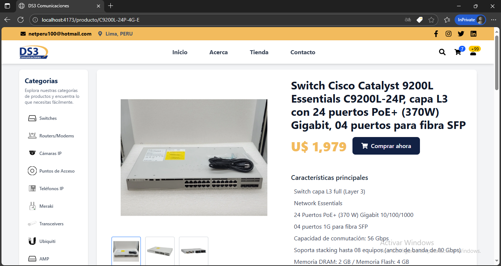

# 🛒 DS3 Comunicaciones - Catálogo Web

Este proyecto es un **catálogo de productos tecnológicos** desarrollado con **React + TypeScript + Vite + TailwindCSS**.  
Su objetivo es mostrar productos de redes (Cisco, AMP, Ubiquiti, etc.) con un diseño **responsivo**, moderno y fácil de usar.

---

## 📸 Capturas de pantalla

### Página de detalle de producto


> Ejemplo: Switch Cisco Catalyst 9200L Essentials C9200L-24P


> Ejemplo: Cable UTP AMP Categoria 6 Chaqueta CMR 23AWG 6-1427200-4
---

## 🚀 Tecnologías usadas

- ⚛️ [React](https://react.dev/) (con TypeScript)
- ⚡ [Vite](https://vitejs.dev/) (bundler)
- 🎨 [TailwindCSS](https://tailwindcss.com/) (estilos responsivos)
- 📦 [gh-pages](https://www.npmjs.com/package/gh-pages) (para deploy en GitHub Pages)
- 🔗 React Router DOM (navegación SPA)

---

## 📂 Estructura del proyecto

```bash
src/
 ├─ assets/          # Imágenes, íconos y recursos
 ├─ components/      # Componentes reutilizables (Header, Footer, Sidebar, etc.)
 ├─ pages/           # Páginas principales (Home, ProductPage, etc.)
 ├─ data.ts          # Base de datos local de productos
 ├─ App.tsx          # Configuración principal de rutas
 └─ index.css        # Estilos globales
